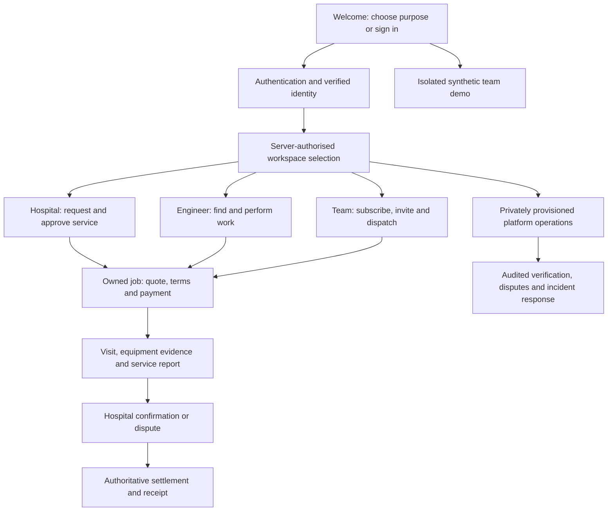

# EquipSeva — product and delivery plan

**START HERE · owner direction recorded 19 September 2026 · implementation is staged, not released.**

EquipSeva connects hospitals with biomedical engineers and gives engineering businesses a paid workspace to manage their teams. The platform owner governs the service. We continue the existing Android app and backend; we do not start again or discard working features.

This is the governing product plan for new work. It supersedes conflicting older role, map, billing and page-sequencing proposals. The approved lime/ink visual theme, original logo and existing security/release gates remain. **Owner decision, 23 September 2026: the product is English only** — no Hindi/Telugu translations, words, locale resources or language pickers; this supersedes every EN/HI/TE reference in earlier plan text. Historical handoffs are evidence of their recorded revisions, not a competing roadmap.

## Read in this order

For a visual summary, read the [seven-page overview PDF](docs/product-plan/EquipSeva-Product-Plan-Overview.pdf). Detailed contracts below govern implementation.

1. This document: product boundaries, decisions and delivery order.
2. [Pages and workflows](docs/product-plan/PAGES_AND_WORKFLOWS.md): the full existing-page carry-forward map and new workspace pages.
3. [Architecture and migration](docs/product-plan/ARCHITECTURE_AND_MIGRATION.md): existing source, tenant model and compatible rollout.
4. [Security, payments and abuse](docs/product-plan/SECURITY_PAYMENTS_AND_ABUSE.md): permission, fraud, billing and device controls.
5. [Delivery ledger and acceptance](docs/product-plan/DELIVERY_LEDGER.md): scope, evidence, review and next implementation slice.

## 1. Four people, three public registration choices

First-time welcome asks **“How will you use EquipSeva?”** with three large, labelled options:

| Choice | Main outcome | Live access requirement |
|---|---|---|
| **Biomedical engineer** | Find suitable work, quote, perform authorised repairs and track earnings | Verified identity/contact; qualification and payout checks appropriate to the action |
| **Hospital administrator** | Manage a hospital/site, request service, approve terms and verify completion | Verified account plus authority over the claimed hospital/site |
| **Engineering team / organisation** | Manage engineers, assignments, service operations and business reports | Verified organisation/sole operator, active membership, and a server-confirmed subscription for paid capabilities |

**Sign in** remains immediately visible for existing users. Selection is registration intent, never a permission grant. Returning users restore an authorised workspace; they do not repeat signup. An invitation is accepted only after authentication and confirmation of the intended identity and organisation.

The **platform owner** is the fourth persona, privately provisioned. There is no “Founder” signup card, purchasable owner role or client-side admin switch. Platform access uses mandatory MFA, least privilege, fresh authentication for sensitive actions and auditable support access.

### What “all access” means

An engineering-team owner can administer **their own organisation**: staff, assigned service work, company reports, subscription and permitted business settings. Paying does not expose other teams, other hospitals, platform moderation, an engineer's personal bank details, private independent jobs or unrelated chats. Hospital information is shared only through explicit site membership or an authorised job/service relationship.

A team head who also repairs equipment has a separately verified engineer identity and assignment eligibility. A hospital-employed biomedical engineer can join a hospital's team by invitation without becoming its administrator. One verified login may hold multiple memberships, but every action has one explicit active workspace and job owner. The first release supports this data model while keeping the workspace switcher simple.

## 2. Non-negotiable product rules

- **No maps or GPS-dependent normal workflow in the target app.** State/UT and district define location and service coverage. Do not replace real coordinates with zeroes to satisfy old APIs.
- **A subscription buys software features, not trust or authority.** Verification, membership, capability and current subscription are separate checks.
- **Account and workspace isolation precede wider UI rollout.** Late requests, offline work, notifications, photos, receipts and cleanup cannot leak into or erase another login/workspace.
- **Money and service evidence remain authoritative.** A callback, screenshot, animation, expired subscription or locally changed role cannot prove payment, erase a dispute or rewrite an accepted contract.
- **No claim of an unhackable or uncloneable app.** Make tampering costly and deny unauthorised operations at the server, even with a modified client.
- **Continue existing accounts and records.** No global role reset, destructive migration, forced re-registration or silent reassignment of historical jobs.
- **The demo is synthetic.** No shared production demo password, real hospital/engineer data, payouts, live invitations, external messages or hidden production mutations.
- **No new dashboard website work.** The existing website workstream stays paused; this plan belongs in the repository and app work.

## 3. Registration, verification and account recovery

### Common path

Welcome → choose purpose → Google/email authentication → confirm contact → choose/create/join workspace → State/UT + district → minimum role-specific setup → verification/status screen → permitted workspace home.

Preserve drafts only for the same authenticated owner. Do not persist passwords, OTPs or sensitive document contents merely for convenience. Account linking requires proof of the existing account; matching an unverified email is not sufficient. Signup, email confirmation, password reset, expired links, cancelled Google consent, offline recovery and process death have explicit retry/cancel routes.

- **Engineer:** personal name/contact, base district, selected service districts and equipment skills; submitted qualification/identity documents go to review. Unverified users may complete their profile and see limited information, but cannot imply verified eligibility. Bank details are requested when required for payout activation, with separate protection.
- **Hospital:** create a hospital/site claim or join an existing site. Capture facility name, private postal/service address, state/district and responsible contact. Verify manager authority; email domain, payment and a business name are insufficient alone. Potential duplicate claims enter review rather than overwriting the first hospital owner.
- **Team business:** select organisation or sole operator; enter display/legal details appropriate to that type, base district and coverage. A sole operator need not invent a company or GST number. Trial/demo exploration can precede paid activation; live organisation authority still requires checks. Invitation recipients keep their own identities and consent.
- **Recovery:** provide provider-compatible reauthentication for Google-only accounts; no password-only dead end. Admin/owner recovery must not allow a support shortcut around MFA or ownership verification. Lost owner access has an audited recovery path, not a self-claimed new owner.

Request phone verification once at the first action that needs a trusted contact. Reuse the verified result; changing the phone is a sensitive action. Explain why each document is requested and what it does **not** certify. EquipSeva verification is not a government licence or a guarantee of clinical competence.

## 4. Workspaces and permissions

| Role inside a workspace | Can do | Cannot do |
|---|---|---|
| Engineer | Own profile, eligible opportunities, own/assigned quotes, assigned visits, evidence, personal earnings | Self-approve KYC, see competing sealed bids, assign themselves to another team's work |
| Hospital owner | Own sites, staff invitations/roles, service approval and organisation settings | Access other hospitals, verify their own disputed completion as the engineer |
| Hospital manager | Delegated sites, requests and approvals within configured limits | Transfer ownership, change owner MFA or bypass spending limits |
| Hospital biomedical staff | Assigned equipment/service tasks at explicitly delegated sites | All hospital sites, billing, staff administration or self-approval of work they performed |
| Team owner | Team membership, business subscription, assignments, allowed finance and reports | Platform administration, engineer personal credentials or unrelated client data |
| Team dispatcher/admin | Delegated scheduling, quotes and team jobs | Ownership transfer, unrelated finance/exports or self-awarded payout authority |
| Team engineer | Explicitly assigned work and shared information necessary for it | Entire company customer book, team billing or every colleague's jobs |
| Platform owner / delegated operator | Permission-scoped support, verification, moderation, incidents and platform operations | Unlogged impersonation, secrets/passwords, silent money edits or unrestricted permanent data exports |

Start with a small built-in permission set rather than a complex custom-role editor. Server membership and resource ownership govern all reads, writes, exports, attachments and realtime channels. UI visibility is a convenience only. Tenant IDs supplied by a client are untrusted selectors.

An independent engineer's **personal workspace** is authorised by the authenticated identity matching its immutable owner, plus the existing role/verification and object checks. It does not require company membership or this new team subscription. Organisation membership rules apply to organisation contexts; this is not a fallback allowing a missing or invalid organisation membership to become personal access.

Hospital managers and biomedical staff receive explicit site scopes. An empty scope grants no site data; only the verified hospital owner has the intentional organisation-wide scope. Removing a site or membership invalidates that authority even if the job belongs to the same organisation. Staff cannot countersign their own engineer work.

Member removal immediately denies new server operations for that workspace and reassigns outstanding work deliberately. Connected clients retire local capabilities when informed; a disconnected device cannot learn revocation instantly. The security plan defines bounded offline leases and reconnect validation, and already viewed/exported copies cannot be recalled. Ownership transfer requires acceptance by the new verified owner, step-up authentication and an audit record; prevent removal of the last owner. Billing ownership and organisation ownership are reconciled explicitly. Revoked users retain only records the retention/export policy actually entitles them to.

## 5. Demo and monthly subscription

**Default launch design:** a guided, resettable on-device demo with fictional hospitals, engineers and jobs, visibly labelled **Demo**. It does not need a shared account or card. Users can practice creating a request, assigning an engineer and reviewing a report. The demo has a separate repository/navigation boundary and cannot call live mutation APIs. On exit, discard synthetic work; never copy demo receipts, verification or permissions into a real account.

Live activation: verify account/organisation → display plan and limits → start approved checkout → server verifies entitlement → workspace opens its paid capabilities. A valid payment for an unverified organisation stays “paid, verification pending,” with a clear refund/support path. An eligible member cannot accidentally purchase into the wrong workspace: show workspace identity before and after checkout and bind the transaction server-side.

Use one understandable monthly organisation plan initially, with a configurable included active-seat limit and clear limits before purchase. Invitations reserve capacity only under an explicit expiry policy; enforce seat allocation atomically. Do not charge each engineer independently for the same team subscription. The monthly price, included seats, taxes/invoice treatment and exact cancellation/refund terms remain commercial configuration to finalise before accepting live charges; do not invent a price in code or advertise “unlimited.” No annual plan, automatic seat upsell or live free-trial billing is needed for the initial demo.

Digital software subscription and physical repair/onsite AMC payments are **different products and ledgers**. The distribution-channel billing requirements in the security/payment document are a launch gate. Do not reuse AMC contract subscription identifiers as SaaS entitlements.

Keep provider billing lifecycle separate from derived app access: **Pending / Active / Grace / Restricted / Suspended**. Cancellation at period end is a flag with a paid-through timestamp, not immediate suspension. Entitlements come from verified server/provider state; the transition/precedence table in the security/payment document governs. Only server-confirmed provider grace applies; no client-created free period or live trial at launch. Invalid identity, membership or security state overrides paid access. Out-of-order webhooks cannot resurrect an expired grant. On lapse, block new paid commitments but preserve authorised read access, receipts, dispute/support access and a bounded completion path for already committed service work. Expiry never authorises deletion of evidence or interception of earned payouts. Security suspension can impose stronger restrictions with supervised service handover.

## 6. District-based service coverage and attendance

Use **India → State or Union Territory → District** everywhere relevant. Engineers have one base district and an explicit multi-district service area. Hospitals have a district for each site; organisations have a base district and coverage districts. Changing the state clears an incompatible district. District names are labels; persist official stable codes plus catalog version. No fuzzy substring matching is an authority decision.

Import a reviewed, dated [Local Government Directory](https://lgdirectory.gov.in/) snapshot, including inactive/replaced-code history. The [government district dataset](https://www.data.gov.in/resource/local-government-directory-lgd-districts) is a source candidate, not a claim that a current complete asset is already bundled. The current app's string catalog has conflicting comments and a 2024 provenance claim; it must be reconciled. No internet permission prompt or geocoder is needed to choose a district. Bundle a small verified catalog and refresh it atomically through a versioned cache; do not fetch a directory per keystroke.

Historical jobs keep accepted site/address/district snapshots. Region splits/mergers map through explicit alias history; ambiguous legacy names require confirmation. During rollout, unresolved regions remain readable and can save a draft or request catalog correction, but cannot silently enter an arbitrary district's job feed. Search uses district eligibility, equipment skills and declared availability; never advertise “nearest,” kilometres, geofenced proof or live tracking without those inputs.

The private address/landmark and hospital contact still matter for reaching the equipment. Share them only with authorised service participants at the relevant booking state. State/district alone does not prove identity, arrival or professional competence.

**Replace GPS check-in deliberately:** server-issued, short-lived, single-use attendance challenge, bound to the job, assigned engineer and authorised hospital participant, followed by required before/after evidence and service report. Do not treat a forwarded code as independent proof of physical presence. Retain hospital countersign, duplicate-evidence/collusion review and dispute access. A missing hospital representative or offline device has a documented pending/manual-review path; no fabricated “checked in” or blocked access to emergency support. Define and test offline evidence durability before promising it.

Ship new server discovery/attendance contracts and old-client compatibility before removing map screens, GPS calls, permissions and dependencies. A feature flag may stage the migration, but cannot silently re-enable GPS in the newly promised map-free flow. Preserve legacy attendance evidence for audit under its retention policy.

## 7. Main workflows and page tree

Hospital: Home → Request service → compare eligible quotes → accepted scope/terms → payment state → visit → evidence/report → confirm or dispute → receipt/history.

Engineer: Home/Jobs → eligible district work → quote → assignment/terms → visit preparation → attendance/evidence → service report → confirmation/dispute → earnings/payout status.

Team navigation has four labelled tabs: **Overview / Jobs / Team / Organisation**. Reports are a labelled action from Overview; billing and owner settings sit within Organisation. Show the company and active workspace clearly. A dispatcher assigns only consenting, active and appropriately verified members; reassignment requires service-party acknowledgement when it changes the accepted agreement.

Platform owner: a secured operations entry separates verification, organisations/subscriptions, disputes, payment exceptions, abuse, audit and health. Prefer exception queues over thousands of default dashboard tiles. Platform health counters must be observed, not animated fiction.

The page plan maps every existing screen to retain/adapt/replace/retire and lists additional pages. A plan or a navigation shell is not an implemented page. Each branch ships complete useful states before the next expands.

## 8. Design system retained

| Token | Light | Dark |
|---|---|---|
| Canvas | `#F4F5F2` | `#0C0F0B` |
| Surface | `#FFFFFF` | `#1B2018` |
| Primary text | `#11150F` | `#F5F7F1` |
| Secondary text | `#555D50` | `#B9C2B1` |
| Primary action | `#C6FF00` with `#11150B` text | Same pair |

Original logo stays intact. Space Grotesk headings **28/34sp, 600**; Inter body **16/24sp, 400**; labels/buttons **14–16sp, 600**; supporting text **12–14sp, 400/500**. The app ships no Hindi/Telugu copy and bundles no Devanagari/Telugu fallback fonts (English only, owner decision 23 September 2026). Main actions have 52dp minimum height and a 26dp radius cap that permits taller text; targets at least 48dp; cards 24dp; hero/sheets 28dp; fields 16dp. Use existing tokens, not a second hard-coded theme.

Every page covers loading, empty, ready, error, offline, pending, denied and success where applicable; retained data always belongs to the current login/workspace. Do not use lime alone to claim paid/verified/complete. Large text, small screens, light/dark, English copy, keyboard/Back, screen-reader labels and reduced motion are acceptance requirements. New admin/billing copy is English and must be reviewed too. Human task validation includes hospital staff, independent/team engineers, team owner/dispatcher and the platform operator; record observed completion, mistakes, recovery and participant limitations separately from agent review.

## 9. Security and fraud posture

Prioritise server resource authorisation, safe session/workspace mutation, verified payment state and auditable sensitive changes. Layer app signing, integrity attestation, Keystore-backed secrets, minimal exported components, verified links, rate limits and dependency scanning around them. Server/service-role/payment secrets never belong in the APK. A rooted-device check or obfuscation does not replace these controls.

Keep separate risk controls for fake engineers, fake hospital authority, fake team ownership, referral/trial abuse, collusive jobs/reviews, copied evidence, account takeover, forged payment callbacks, payout redirects and insider misuse. Risk signals route to bounded review and appeal; they are not automatic proof of guilt. Sharing an IP/device/phone prefix alone cannot justify permanent bans.

High-risk actions require current identity, workspace membership, object authority, allowed lifecycle state and any applicable paid entitlement; privileged/money actions also require freshness/integrity/step-up policy. At-risk environments may be limited to recovery/support and permitted reads. Clearly distinguish failed integrity, unavailable attestation and ordinary network outage; preserve submitted work safely without turning an outage into unlimited write access.

Founder power is controlled too: no hidden password viewing, silent cross-tenant impersonation or unaudited evidence deletion. Initially a solo founder may hold several operational permissions, but self-approved exceptional money releases and ownership overrides are disabled. Use the documented provider/support escalation path until a separate authorised approver is available. Ordinary tested settlement and accepted owner-to-owner transfer flows remain available under their checks; the same person clicking twice is not independent approval.

Collect equipment-service data, not patient records. Warn before uploads, limit file types/size, strip unnecessary metadata and protect original evidence needed for disputes under a documented retention basis. Access/deletion/export controls and privacy notices must match actual behaviour. Legal/provider review remains a release dependency, not a compliance claim from this plan.

## 10. Load, reliability and operations

Keep the Android app as a modular monolith with shared components and bounded feature packages; extend the existing backend before introducing microservices. Small typed contracts, server filtering, cursor pagination and appropriate tenant/district/status indexes come before broad caching or new infrastructure.

- Lists default to 25 records, enforce a server maximum of 100, and paginate. Search is debounced and cancellable. Bound image uploads and concurrent transfers; do not download all original evidence into list cards.
- Cache catalog/public data separately from private `(user, login, workspace, resource)` data. Account/workspace change immediately retires visible private state; cleanup and late callbacks validate ownership inside real mutation boundaries.
- Subscribe realtime only to authorised visible workspace/jobs; release leases safely on navigation or membership loss. Push is a hint to fetch authorised state, not a trusted route or tenant grant.
- Queued writes carry their originating owner/workspace, idempotency key and schema version. Offline mode never creates fresh paid/admin authority. Payment and assignment mutations reconcile from the server after reconnect.
- Record p95 latency, errors, slow SQL, queue age, webhook lag and denial/replay counts without credentials or personal data in logs. Set alerts on observed baselines.
- Capacity targets are **test hypotheses**, not certified capacity: representative datasets at 1k/10k/100k jobs, concurrent tenant mixes at 50/200/500 active clients and a separate webhook burst. Agree a load profile and latency/error budgets before calling any tier supported; measure resource/cost headroom, cross-tenant isolation and backlog recovery.
- Test restore/rollback and reconciliation from backups. Have incident runbooks for token/key leak, tenant access regression, payment inconsistency, provider outage, compromised admin and catalog rollback. Kill switches block new risky work while preserving receipts/evidence/support.

## 11. Implementation order and acceptance

| Stage | Bounded result | Depends on |
|---|---|---|
| **P0** | Reviewed master plan, complete page mapping, current-source reconciliation and delivery ledger | This owner direction |
| **P1** | Account/session/workspace ownership foundations; repair existing S1 cleanup and S3 recovery blockers | Existing A1/Room/A2/A10 preserved |
| **P2** | Scoped membership/permission model and canonical region contract; safe legacy migration | P1; direct server denial tests |
| **P3** | Three-choice registration, existing-user workspace entry, verified joins and synthetic demo | P2; demo/live boundaries tested |
| **P4** | Monthly organisation entitlement, compliant checkout, seats and billing management | P2; provider configuration and payment reliability |
| **P5** | Hospital and engineer job journey, district discovery and map-free attendance | P1/P2; new server contracts and fraud/recovery tests |
| **P6** | Team operations: invitations, dispatch, status/reporting, delegated admin and ownership transfer | P2/P4/P5 |
| **P7** | Remaining profile/chat/AMC/admin pages, accessibility and code audit | Relevant ownership and money foundations |
| **P8** | Real provider/device pilot, signed release, monitoring/restore readiness and final independent audit | All applicable gates |

UI layout/prototype work can run alongside isolated backend foundations, but it cannot ship live privileged controls before their server contracts. Preserve prior accepted work; merge bounded tested changes, not all accumulated WIP simply because documentation landed.

Every implementation milestone supplies tests, exact revision, evidence and an independent critic **and** QA review. Both require **at least 9.5/10** for their declared scope, with no unresolved critical/high security, money/data loss, blocked core journey or missing mandatory evidence. Scores are not averaged across blockers, and a planning score cannot become an app score. Keep reproduced failures enabled. Screenshot updates require visual review and Linux baseline recording; never relax tolerances to hide regressions.

Current source has known cleanup, navigation, payment, attestation and visual acceptance work. The broad app draft remains blocked. No planning change waives those gates.

## 12. Progress and decisions still bounded

The previous “about 50% pending” was an unmeasured estimate for a narrower scope. **Do not reuse it for this expanded product.** Track each requirement with separate design, implementation, integration and release-evidence states. The delivery ledger is authoritative; page counts, LOC and passing-test percentages are not completion percentages.

Owner-approved direction: the three public purposes, privately controlled platform owner, monthly team access with a demo, state/district instead of maps, unchanged theme, high security, staged implementation and — from 23 September 2026 — English-only product copy. Product defaults in this document resolve routine workflow choices and can be revised through a recorded decision before affected code ships.

Before live subscription launch, settle the actual price/seat allowance, billing channel enrollment, terms/taxes/refund handling, provider credentials and support ownership. Before broad rollout, establish verified organisation-claim evidence, retention periods, incident contacts and device/provider/user-validation evidence. These are named launch dependencies; independent design, synthetic testing and safe foundational coding can proceed now.

**Next:** the first bounded P1 ownership slice in the delivery ledger; registration/page contracts may be prepared independently without granting new authority.
