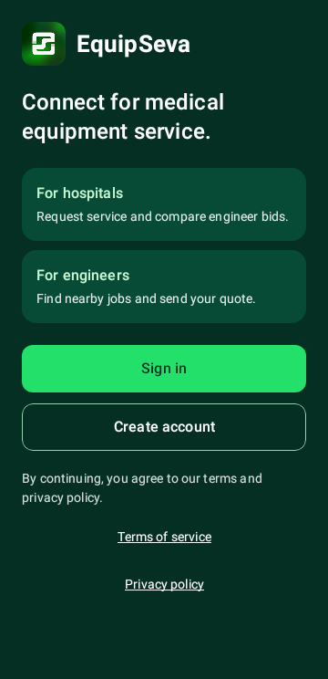

# Welcome component render evidence

The new screen has a clear Sign in action, secondary Create account, brief
hospital/engineer explanations, and separate Terms and Privacy actions. The
existing EquipSeva mark, Seva palette, public callbacks and legal URLs remain.

Eleven focused tests pass. Six exercise every word and each complete button at
2x text scale in English, Hindi and Telugu, at 320dp portrait and 640x320dp
landscape. Both theme runs measure all eleven text items against actual drawn
pixels; minimum text contrast is 8.3127:1. Callback isolation, button roles,
target padding, brand heading and informational audience cards are covered.

The normal `light-top` and `dark-top` images show the deliberate brand surface.
Large-text `initial-viewport` and `actions-viewport` images show sampled scroll
positions. They do not claim all content fits one viewport or that the initial
sample is scroll-zero. Each word and each full action is tested separately.

These are offline, synthetic Robolectric native-Canvas captures, not photos
from a real phone. TalkBack, keyboard/IME/system-inset behavior, native-language
review and representative user validation remain open. The full app and signed
release are not accepted by these screenshots.

Source hashes, raw failure history, full-bar results and artifact hashes are in
[verification.json](../auth-integration/verification.json). Independent reviews
are [critic-review.md](../auth-integration/critic-review.md) and
[qa-review.md](../auth-integration/qa-review.md). No failing test was removed or
font scale reduced to obtain a passing render.
