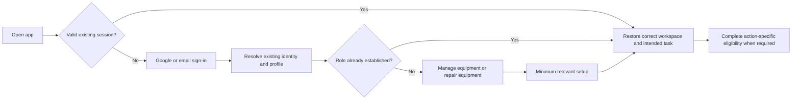

# EquipSeva — product, experience, security and quality plan

Planning edition, 7 September 2026. Continue Claude's shipped product. This document proposes the next execution program; it is not a record of completed implementation or an app quality certificate.

Execution has started. Use `equipseva-execution-checkpoint.md` for the current
branch, test results, independent reviews and unresolved operational failures.
The starting-point evidence below describes the original planning baseline.

Owner's merge policy: completed, verified features and milestones should reach
GitHub `main`. Keep unfinished work on a development branch; fetch and reconcile
concurrent changes, pass the applicable independent quality/integration gates,
and inspect deployment effects before merging. This authorization persists;
do not ask for it again on each feature. A main merge does not waive separate
production migration, provider or signed-release gates.

Owner confirmed full execution takeover by Codex on 7 September 2026. Codex is
the lead for planning, implementation, security, QA/critic coordination, GitHub
integration and maintained handoff notes. Continue Claude's committed baseline;
preserve any subsequently discovered concurrent changes. Routine task-relevant
work proceeds under this standing delegation without repeated permission asks.
This does not convert missing verification into acceptance or waive the recorded
production and release gates.

**1. Starting point and evidence**

The local project is `C:/Users/lokes/equipseva-android`. Planning used an isolated snapshot at `fe4637568059e49f27fb46f8627fe56bccc45e27`. During discovery Claude reconciled the branches: both remote `main` and `ops/r1388-calendar-burndown` were observed at that revision. The previous main was retained in history and tagged `archive/main-r1516-deferred-features`. The old instruction that main is always stale is now obsolete. Fetch and inspect actual branch state before each implementation session.

Preserve the existing Kotlin/Jetpack Compose/Material 3 app, Supabase backend, encrypted session and local database foundations, current jobs/AMC/payment contracts, three-language support, and demonstrated tests. Modernize in bounded changes; a replacement application would discard valuable behavior and introduce unnecessary migration risk.

Evidence available now:

- Round3820 is the latest application change in this snapshot. It registers repair photos through an evidence outbox and restores INFO SDK logging. Production migrations through round3819 are recorded in the latest handoff; this planning team has not queried production.
- Saved local test XML was inspected: 2,791 tests, 332 suites, zero failures/errors/skips. The handoff records successful lint/build and Android CI at `3f4d5213`. These are historical build results, not a fresh complete test of this planning snapshot.
- The updated handoff records foreground timer refresh and successful request-time recovery after a later timer refresh failed. Background/process-death/revocation/offline variants remain distinct tests.
- The latest saved handoff still queues the daily cron confirmation and the actual round3820 photo path on-device. Their current live status must be reconciled in M0, not guessed from elapsed time.
- Code Red scheduling was activated by the main merge. Its existence does not establish a reliable five-minute operational response: the earlier ledger measured large scheduler delays.
- The web console's approximately 9,700 TypeScript errors are a recorded earlier observation, not a rerun here. Reproduce, classify and baseline this debt; do not let a green Android build imply the web surface passes.
- Three independent planning reviewers examined product/auth, security, and QA. They performed targeted source reviews, not a complete audit or app execution. No present-day full-app score is justified.

The governing references are the latest `docs/HANDOFF_2026-09-07_0645UTC.md`, `docs/SESSION_REFRESH_round3816.md`, `docs/UX_UPLIFT_PLAN.md`, and the actual code/workflows at the snapshot. The older PRD, PENDING and roadmap files remain historical context. Statements such as "all correctness work is done" must be replaced with scoped evidence.

**2. Product direction**

EquipSeva should help a hospital get equipment serviced with clear responsibility, cost and proof, and help a biomedical engineer find suitable work, complete it reliably and understand payment. The primary journeys are hospital and engineer; founder administration is a separate privileged workspace.

The principal success measure is a correctly completed service journey: the right engineer, explicit agreed terms, authorized actions, retained service evidence, and reconciled payment where enabled. Downloads, screen count, motion count and lines refactored do not measure this outcome.

Proposed experience principles:

1. Show the next useful action, the current state, and why any action is unavailable.
2. Ask for information when it has a clear purpose; preserve server-side eligibility and authorization at every commitment.
3. Keep one prominent primary action per screen/state, with cancellation, help, dispute and recovery reachable.
4. Make prices, payout estimates, timing, pending work and limitations truthful. Never display a success that the server has not confirmed.
5. Preserve user work through interruption while isolating every person's drafts and background tasks.
6. Design for an engineer outdoors, a busy hospital administrator, poor connectivity, a small phone, large text and assistive technology.
7. Use named personal accounts. A shared hospital password is not an organization/team permission model.

The initial redesign covers both roles, AMC and cross-cutting screens. Founder security is audited early; founder visual simplification and web-console remediation are separate milestone slices. Native iOS, AI diagnosis, lending, new business verticals and revival of archived commerce features are not dependencies of this renewal.

**3. Recommended login, identity and onboarding**

Start with a concise value explanation and two reliable choices: **Continue with Google** and **Continue with email**. Preserve existing email/password accounts and password recovery. Retain the project's explicit Google account picker, which was introduced after an account-switch problem. Credential Manager is already implemented; use its native flow and clear provider state on explicit sign-out. [Android Google sign-in guidance](https://developer.android.com/identity/sign-in/credential-manager-siwg), [Credential Manager reference](https://developer.android.com/reference/androidx/credentials/CredentialManager).

Avoid adding several competing login methods at once. Email-code login and passkeys are later feasibility/user-research decisions; SMS-only login is not the proposed default. The current phone form stores a number without OTP, so the redesign must never label that number "verified." Any new verification path needs delivery, retry, expiry, abuse, account-linking and recovery tests before use.

Target flow:

- Existing users return to their intended task rather than repeat the introduction or role choice. Preserve a safe return destination from a job notification or recovery flow; reauthorize it after login.
- New users choose a plain-language intent once: "I manage equipment" or "I repair equipment." Role creation must succeed before navigation claims the role exists. A missing role must not silently become engineer access.
- A role switch changes the workspace within one identity; it does not grant organization membership or another person's data. Founder privileges are never self-selected.
- Recommended onboarding becomes progressive: useful workspace first, then clearly explained readiness steps before protected actions. This is a deliberate workflow change from the current global gate. The existing engineer policy requires both UPI and bank details; retain it until a documented business/provider decision changes it. Do not silently substitute one method or bypass KYC through a new Home link.
- M2 must specify an eligibility matrix for viewing available work, bidding, directory publication, direct invitations, AMC acceptance, check-in, report countersigning and payout-method changes. Separate phone presence from verified contact, KYC from payout readiness, active workspace from role membership, and membership from ownership. M4 implements the reviewed matrix and direct API denials; unclear policy stays a named dependency.
- Public pre-login content initially contains product explanation, coverage and non-sensitive trust information. A public engineer directory is optional and requires privacy/access review. Private jobs, exact sites, contact details, documents, chat and payments remain protected.
- Treat temporary offline refresh, invalid credentials and revoked sessions differently. Never loop forever, repeatedly erase local work, or present a network timeout as a wrong password. Sign-out and recovery must remain reachable.
- Reauthentication must work for Google-only and password accounts. Require server-enforced fresh authentication for destructive account actions and sensitive identity/payout changes; founder privileges require a designed MFA/recovery flow with backend enforcement. A password prompt in the app alone is not sufficient. [Supabase MFA](https://supabase.com/docs/guides/auth/auth-mfa).
- Define device-only versus all-session sign-out clearly. Test delayed autosave/workers after sign-out; clearing a store once is insufficient if an old job can write it again. Do not merge identities by unverified phone/name. [Supabase identity linking](https://supabase.com/docs/guides/auth/auth-identity-linking).

**4. Recommended user workflows and interface**

Hospital navigation starts with **Home, Bookings, Messages, Profile**. Home leads with **Request service**, a prioritized next action for active work, and recent bookings. Equipment/maintenance and AMC remain easy to reach from Home/Bookings; promote them to a tab only if representative task tests justify the extra destination. Direct Request service should not require choosing an engineer first; browsing/requesting a known engineer remains an alternative.

Hospital journey: equipment/recent asset → problem and photos → site and visit urgency → clear review → request submitted with job number → bids and availability → explicit quote/engineer confirmation → authoritative payment status → work timeline → service report review/countersign or dispute → completion, invoice/payment status and rating. Preserve unknown-serial handling where allowed, and explain why capturing the serial improves equipment history. Existing draft autosave is reused and secured, not rebuilt as if absent.

Engineer navigation starts with **Today, Jobs, Earnings, Profile**, keeping familiar destinations while making Home task-focused. Jobs contains Available, My bids and Active work with remembered filters. Provide a consistent Messages shortcut and unread state from Today and every job. Compare this four-tab proposal with a five-tab variant in the prototype; navigation changes require task evidence, not preference alone.

Engineer journey: readiness checklist → suitable available job → transparent bid/net estimate → assignment → travel/check-in → before photos → work/service report/after photos → hospital response or revision → completion and payout tracking. Today's assigned work comes before promotional tiles. Assigned-only buttons must be supported by both UI and backend checks. An engineer waiting for KYC sees the real approval state, permitted orientation and a clear next step.

AMC follows its own contract and visit state model: create/review terms → payment if required → scheduled visit → engineer confirmation → service/evidence/report → next visit or escalation. Do not present an AMC visit as a marketplace job requiring a bid. Empty maintenance calendars must explain their time window and required source data.

M2 also specifies business exception journeys: no bids, withdrawn/expired bid, engineer no-show, reschedule/reassignment, proposed quote increase/rejection, hospital unavailable to countersign, failed/refunded payment, cancelled work and overdue AMC visits. Every branch names the responsible actor, authoritative visible state, permitted next action, deadline/escalation, money consequences and support/dispute route. A generic error screen is not an adequate specification for these cases.

The proposed "next action" system is deterministic and explainable. Inputs are authenticated actor, current role/membership, server job/contract/payment state, deadlines, required evidence and outstanding user work. Default priority is: service-critical or security issue → active commitment needing action → payment/signature waiting → readiness obstacle → new work. Severity, imminent deadline and consequence of delay break ties and can override that default: an expiring contract or signature blocking payout can outrank nonurgent active work. Define and test those rules in M2. It must not hide an urgent job behind a profile-completion nudge, and remaining actions stay reachable beneath the prioritized card. User-selected actions always revalidate the latest server state.

Bid comparison can explain equipment fit, verified qualifications, availability, total agreed cost and relevant track record. Any recommendation needs a stated reason and fair treatment of new engineers. No automatic bidding, acceptance, payment, report signing or opaque AI ranking is introduced by the redesign. AI assistance, if later useful, may draft or summarize with user review; it cannot manufacture evidence or make authorization decisions.

Every screen gets a state contract: initial/loading, content, empty, partial failure, offline, queued, permission denied, unauthorized/stale session, success and terminal state where applicable. Show distinct states for "saved on device," "uploaded," "attached to job," "evidence registration pending," "payment pending" and "paid." Retry non-idempotent writes only through deduplicated server contracts.

Visual direction: calm professional Seva green `#0B6E4F`, neutral paper surfaces, readable dark text, strong hierarchy and modest state-driven motion. Keep Material 3 and consolidate semantic color/type/spacing/radius/component roles. Avoid decorative dashboards, excessive banners, dense menus and animation that delays work. Loading placeholders should match incoming content; keep inline progress for submitted actions. Large figures never imply unsupported earnings or response guarantees.

Accessibility starts in the component library: 48dp interaction targets, normal-text contrast at least 4.5:1 and qualifying large text at least 3:1, correct labels/state announcements and focus order, non-color status cues, keyboard visibility, 1.3x/2x text, and English/Hindi/Telugu layout/copy checks. Decoration can correctly have no spoken description. Automated checks supplement manual TalkBack operation. [Compose accessibility defaults](https://developer.android.com/develop/ui/compose/accessibility/api-defaults), [accessibility testing](https://developer.android.com/develop/ui/compose/accessibility/testing), [Android contrast guidance](https://developer.android.com/guide/topics/ui/accessibility/apps). Use compact phone layouts and tested adaptive arrangements for larger widths; do not force a desktop dashboard onto a phone. [Android list-detail guidance](https://developer.android.com/develop/adaptive-apps/guides/list-detail).

Before mass screen changes, produce a clickable prototype covering login/recovery, new-user setup, hospital Home/request/bid comparison/job progress, engineer Today/bid/check-in/DSR, and payment/evidence error states. Test with at least five representative people per role for directional evidence; this small sample is not statistical proof of all-user usability. Record task completion, wrong turns, time and comments. Share the concrete prototype for founder feedback. Under the user's explicit delegation, the lead can choose a routine visual direction after independent review while the founder is away; that authority comes from the user, not from treating silence as approval. Split M2 upfront into M2a (expert-reviewed prototype/state/eligibility specification) and M2b (human validation). After M2a acceptance, reversible M3/M4 preparation can proceed under a clearly labeled provisional direction while M2b is pending. M2b retains its original criteria and must close before workflow acceptance in M5/M6 and release. Do not call the whole M2 milestone accepted without that evidence.

**5. Security and correctness findings that change the order of work**

These came from targeted code inspection. Repository behavior is evidenced; production exploitability and end-to-end impact have not been reproduced. Reproduce in an isolated test environment, verify effective deployed definitions separately, then fix with regression tests. High-priority candidates block affected feature promotion until resolved or disproven by evidence.

| ID | Finding and source at baseline | Required next evidence |
|---|---|---|
| SEC-01 | `supabase/migrations/20260811000000_round492_evidence_65b_chain.sql:124–189`: evidence registration authenticates the caller but does not bind the supplied source/storage/kind to an authorized job participant. | Direct API tests for another hospital/engineer, fabricated source, foreign object and forged signature kind. Derive producer and allowed state server-side. |
| SEC-02 | Same migration `:406–427`: comparison with a missing accepted engineer can evaluate NULL and skip evidence-read rejection. Companion nullable-producer comparison at `:228–231`. | Populate no-bid/AMC/deleted-producer fixtures; prove outsider denial and correct owner/direct-assigned access. |
| SEC-03 | `app/src/main/kotlin/com/equipseva/app/core/data/repair/RequestServiceDraftStore.kt:17,41–54` and `core/auth/SignOutCleanup.kt:51–92`: shared draft has no owner field and is not cleared by that cleanup. | A drafts → logout → B login/recovery, including a late autosave and process death. No prior-user content may appear or replay. |
| SEC-04 | `core/security/PlayIntegrityClient.kt:133` and `supabase/functions/verify-play-integrity/index.ts:277,314`: classic attestation lacks server nonce/action/freshness binding. | Establish intended telemetry versus enforcement role; test replay and account/action substitution. Never count it as backend authorization. |
| REL-01 | `core/sync/handlers/PhotoUploadOutboxHandler.kt:138–154,187–215`: attachment failure can be swallowed, evidence enqueue is best effort, and source file can be removed while reporting success. | Fault injection after upload/append/enqueue, concurrent photos, retry and account switch. Durable upload/attach/register stages and reconciliation. |
| AUTH-01 | `features/profile/ProfileViewModel.kt:513–525`, `core/auth/SupabaseAuthRepository.kt:114–130`, deletion RPC in round479: password-only reauthentication conflicts with Google-only accounts; UI step-up is not enforced by the deletion RPC. | Provider-aware recovery/deletion and direct API freshness/assurance enforcement tests. |
| AUTH-02 | `features/auth/SignUpViewModel.kt:129–170`, `navigation/MainNavGraph.kt:106–112`: role-write failure/confirmation flow can proceed without the intended role; null-role tabs default to engineer. | Existing/new Google/email role matrix, delayed profile, failed role write and confirmation on/off. |

The Android paths abbreviated with `core/`, `features/` or `navigation/` above are beneath `app/src/main/kotlin/com/equipseva/app/`. Priority is investigation urgency, not an invented final severity or evidence of an attack.

Security work covers assets and trust boundaries explicitly: sessions and recovery, organizations/roles, KYC/bank/contact/location data, job state, quotes/escrow/refunds/payouts, files/evidence, founder privileges, web sessions, edge-service credentials and release automation. Test a malicious authenticated API client independently of what the app exposes.

Required controls include deny-by-default object/tenant/role authorization; effective RLS and function EXECUTE/column grants; safe security-definer functions; server-side workflow and money validation; idempotency and webhook replay protection; private file access and retention; encrypted owner-scoped device state; log/crash redaction; abuse throttling; founder MFA/fresh authentication; least-privilege CI and service keys; and tested rollback/restore. Preserve existing valid protections while correcting gaps. Use [OWASP MASVS](https://mas.owasp.org/MASVS/) for the app and an applicability-mapped [OWASP ASVS](https://owasp.org/www-project-application-security-verification-standard/) baseline for backend/web. These are verification references, not a claim of certification.

Account/session generation fencing is an explicit invariant: a request, callback, subscription, autosave or worker started as user A cannot update user B's state, recreate A's cleared draft or execute using B's credentials after an account change. Audit signed URLs and cached document handles under the same ownership rule.

M1 assesses every privileged founder operation and server-enforced recent authentication, including AUTH-01. High-risk exposed actions require repair or containment before feature promotion, even if their final interface redesign occurs in M4/M7. Inventory temporary access and the earlier token-bearing debug-log exposure without reading or publishing secret values; assess affected sessions, remove diagnostic leakage, arrange authorized revocation/rotation at the safe point, and verify recovery. Do not revoke the only working access midway through dependent operations.

Payment acceptance includes a specific case: provider status is authorized, capture later fails. The system must not turn that into withdrawable earnings or an unrecoverable payout. Define and test capture/settlement versus authorization and reconciliation at the actual provider boundary.

A client-provided hash does not by itself establish who created evidence or whether stored bytes match. Verify source/producer authority, immutable object identity, server-observed bytes where required, and traceable capture/upload times. Define whether committed objects can be overwritten/deleted, how superseded evidence versions remain attributable, and how retention interacts with account deletion; ledger immutability and object immutability are separate tests. Do not claim legal admissibility from a hash or a UI badge; legal wording needs separate qualified review.

**6. Milestones and dependencies**

Each milestone is divided into small independently reviewable changes. Existing U01–U45 tasks are retained as a cross-reference, but this program supersedes their cosmetic-only scope, late accessibility pass and unconditional token/motion counters. No fixed calendar promise before M0 measures test setup, effective backend complexity and available reviewer/device capacity.

| Milestone | Deliverable | Exit evidence / dependency |
|---|---|---|
| M0 — Baseline and audit map | Confirm latest shared/GitHub state; identify APK/config/schema; code ledger, route/state/API map, current CI and release triggers, staging fixtures, open test reconciliation, threat model, rollback path. | Both-role baseline app smoke on an identified APK plus scoped session/photo reconciliation; repeatable build baseline; historical versus new results labeled. Missing access/device tests remain open. |
| M1 — Security and data-loss repairs | Reproduce/fix SEC-01–04, REL-01, AUTH-01 server freshness and related isolation weaknesses; assess/contain founder privileges; effective RPC/RLS/ACL and outbox contracts. | Direct API negative tests, positive authorized paths, migration compatibility and rollback/compensation tests. Affected flows cannot ship while high-risk uncertainty remains. |
| M2 — Product and interaction specification | M2a: prototype, both-role normal/exception journeys, login/recovery, eligibility/state/action matrix, navigation and copy. M2b: representative human validation. | Independent artifact review for M2a; recorded task evidence for M2b. Can proceed beside M1 with synthetic data. Provisional preparation after M2a does not waive M2b. |
| M3 — Design and testing foundations | Actual-theme component library, deterministic screenshots, previews, accessibility tests, i18n checks, shared navigation/error/offline components. Old U01–U16 mapped here. | Same-environment visual comparison, real TalkBack/large-text checks, navigation/back/deep-link coverage. Depends on M2a direction; provisional work is labeled while M2b is pending. |
| M4 — Login and readiness | Correct account/role/recovery routing, provider-aware reauth, session recovery, owner-isolated drafts, progressive onboarding with server action gates. | Complete auth/account-switch matrix and unchanged existing-account access. Requires M1 controls and M2/M3 designs; readiness policy is recorded explicitly. |
| M5 — Hospital service journey | Request directly, secured existing draft recovery, bid comparison, transparent quote/payment state, work tracking, report/countersign/dispute, rating. Old U17–U26 mapped here. | Requires accepted M1/M2/M3/M4 controls. Successful/interrupted journeys, wrong-role denials and no duplicates. Contract-stub results and real-provider sandbox results have separate verdicts. |
| M6 — Engineer service journey | Today, discovery/bids, assignment/check-in, before/after evidence, DSR/revision, completion and accurate earnings. Old U27–U32 mapped here. | Requires M1–M4 and integrated M5 contracts. Dual-role real evidence retrieval, concurrent/retried uploads, offline/process-death recovery and payment-state truth. |
| M7 — AMC, remaining screens and operations | AMC visits/contracts/calendar, chat/notifications, founder controls, web audit/remediation slices, CI/cron reliability, dependency backlog, remaining first-party review. | Integrated M5/M6 precede AMC lifecycle acceptance. Each surface has a scored slice; web needs its own build/type/security bar. Independent code audit can run earlier. |
| M8 — Release candidate and pilot | Full device/role/state suite on signed minified build; payment/webhook/payout reconciliation, push, restore/rollback drill, store assets and operational monitoring. Old U42–U45 mapped here. | Requires M0–M7 acceptance, current final-hash whole-program audit closure below, all launch/provider gates, full evidence, independent acceptance, staged pilot and monitoring. |

Old U33–U41 (empty/error/offline/session/confirmation/motion/accessibility) are cross-cutting acceptance requirements from M3 onward rather than one postponed cleanup phase. Motion is added only where it clarifies state. Valid raw geometry and decorative semantics can have documented exceptions; quality is not measured by reaching zero raw numbers.

Payment-rail activation, notification-provider configuration, actual scheduled-job delivery, sensitive administrator account recovery and deployment authorization remain explicit operating dependencies. A frontend can be implemented against tested contracts without declaring those services live. Do not advertise five-minute Code Red dispatch until the chosen scheduler and full notification path demonstrate it.

**7. The 9.5/10 rule**

This is an internal acceptance index for a defined milestone/build, not a scientific universal app score or a guarantee that no bug exists. Plan/prototype scores and implemented-app scores are separate. This document assigns no score to the current app.

Before each milestone implementation, freeze its required scenarios, named test environments, weights, evidence format, severity definitions and performance budgets. Use a 100-point checklist with explicit full/partial/fail criteria, derived from:

| Dimension | Weight |
|---|---:|
| Task completion and state correctness | 25 |
| Security and privacy | 25 |
| Recovery, data and payment integrity | 20 |
| Accessibility, usability and localization | 15 |
| Visual hierarchy and consistency | 10 |
| Performance and operational readiness | 5 |

Score = `10 × earned points / fixed applicable points`. Assign the item points before work starts; this category table alone is not a completed checklist. Designate critical dimensions before seeing results: task completion/state correctness, security/privacy, recovery/data/payment integrity, and accessibility/localization for affected user journeys. Critical security, money, privacy and task-completion items are pass/fail. Missing mandatory execution yields **NOT SCORED / NOT ACCEPTED**. Predeclared not-applicable items need a reason before the denominator is frozen; an inconvenient failure cannot become not-applicable later. Do not round 9.49 up to 9.5.

For each implemented milestone:

1. Builder freezes the candidate SHA, APK hash, backend schema/edge versions and relevant configuration identifiers, and supplies test artifacts and known limitations.
2. A **critic agent** independently walks both relevant user roles, challenges confusing or misleading actions, tests recovery and inspects requirements/diff.
3. A separate **QA agent** independently executes required scenarios, verifies actual backend/storage outcomes and regression results. A security reviewer joins whenever a trust boundary changes. Reviews may share the same requirements and immutable artifacts, but not initial scores; one emulator/build/fixture mutation has one controller at a time.
4. Reviewers write first verdicts independently, then discuss conflicting findings together. Keep each deduction and disagreement until resolved by evidence. Builder cannot sign for a reviewer.
5. Accept only if **QA ≥9.5 AND critic ≥9.5 AND every applicable critical dimension ≥9.5 AND every hard gate passes**. The lower score governs; no averaging away a failure.
6. If below threshold, repair/polish the specific deficiencies, rerun affected checks plus required milestone regression, and obtain independent verdicts on the new candidate. Retain original and final scores. A change invalidates affected evidence, not necessarily unrelated proven areas.

Hard blockers override all points: unresolved critical/high security or privacy defect; unauthorized access; incorrect/duplicate money movement or corrupted/lost evidence; blocked core journey; supported-configuration crash/ANR; missing mandatory test; leaked secrets; unsafe migration/rollback; unsupported signed-release behavior. An untested suspected high-risk path stays an investigation blocker until reproduced/resolved or disproven. No deleting tests, loosening screenshot tolerances, renaming severity or shrinking required scope to manufacture 9.5.

Human usability evidence is separately labeled. Agents can find substantial issues, but their agreement does not substitute for people using the app. If a milestone needs user research or a physical device that is unavailable, report the missing evidence and keep that gate open; elapsed time is not approval.

**8. Test program and proposed measurable targets**

Use the cheapest test that proves a claim: pure logic tests, component/semantics tests, state/repository integration, real database authorization tests, device journeys and signed-release/provider tests have different purposes. The two current instrumented files mostly check boot/package identity; build success is not end-to-end verification. [Android testing strategy](https://developer.android.com/training/testing/fundamentals/strategies).

Minimum scenario matrix: hospital/engineer/founder; fresh/existing/Google/password/missing-role accounts; KYC pending/rejected/verified; assigned/unassigned/foreign actor; loading/empty/partial/error/success; online/slow/offline/lost response; rotate/background/external picker/process death/relaunch; revoked/expired sessions; permission never requested/denied/permanently denied/revoked including camera/location/picker interruptions; A/B account switching; duplicate taps/concurrent updates; payment pending/failure/success/refund/dispute; en/hi/te; standard/large text and TalkBack. Include combined hazards such as offline photo queue + account switch and payment pending + process death. Use synthetic isolated fixtures, never real user data in screenshots.

M0 defines the supported minimum/API and current target/release-device matrix from actual Gradle/Play requirements. Every touched milestone uses a representative compact phone and 2x text configuration; M8 adds minimum-supported behavior, current-target/current-supported OS, a physical lower/mid-range device and larger-window layouts. Do not claim device compatibility from screenshots alone. Canonical screenshot recording and comparison run on the same pinned Linux renderer/SDK/fonts; Windows diffs are diagnostic, not the authoritative gate.

Proposed budgets to validate/freeze in M0/M2, not measured current performance:

- Request service is one tap from hospital Home; returning users reach their active task in at most two deliberate interactions after successful authentication, excluding security-required reauth.
- At least 90% unassisted completion of predefined core prototype tasks in the small role-based pilot, with zero critical errors; always report actual numerator/denominator and timing. Revise the design based on failures, not just the percentage.
- All required role/state/authorization/money tests pass. Existing-account upgrade and shared-device isolation pass with zero cross-user content/replay.
- No loss or duplication of committed work through the injected interruption points; queued work stays visibly pending until its required server stages finish.
- Proposed lower/mid-range release-device cold-start p95 ≤2.5 seconds and ≥95% frames within the device's frame budget on nominated journeys, under a named controlled configuration. Measure TTID/TTFD, network wait and rendering separately; if evidence makes a target unsuitable, record the rationale before freezing it. These are project budgets, not Google's published thresholds. [Android startup measurement](https://developer.android.com/topic/performance/vitals/launch-time).
- Every touched core screen remains operable in all three languages, TalkBack and 2x text; all required touch targets and contrast checks pass.

Run focused tests during changes. On the final milestone candidate run the full existing unit/lint/debug/release-R8 bar plus impacted backend/security/visual/device suites. M8 executes the complete critical funnel on a signed minified candidate. Do not run simultaneous Gradle builds in the shared checkout. Preserve meaningful failure artifacts and regression tests for discovered substantive bugs.

**9. Review every line: coverage and closure**

The accompanying `equipseva-audit-ledger.csv` inventories every tracked file at the planning revision with Git blob, working-copy text hash, area, risk priority, line counts and review/evidence fields. It contains **7,364 files**, of which **7,351 are UTF-8 text**, totaling **1,463,012 nonblank text lines** across code, migrations, tests, configuration, dependencies and documentation. That raw total is not the eventual first-party application-code denominator. M0 classifies provenance/reachability and records each distinct review method. All full-review statuses start **Pending**. Targeted source inspection does not mark a whole file reviewed. File counts, hash inventory and static scans are not proof of line review or testing.

Audit waves: Android/backend trust boundaries → payments/job/AMC state → storage/evidence/chat and lifecycle → role journeys/design/resources → founder/web/edge/cron → remaining scripts/build/config/docs/reference. The 3,375 migration files require both historical-upgrade review and an effective final schema/RPC/RLS/grants map: repeated recreated functions are not 3,375 independent live services. Test representative upgraded databases and the actual deployed definition set; forward corrective migrations preserve deployment history.

For every first-party text file record exact line spans, reviewer, finding IDs, tested contract/journey and reviewed blob. Record dependencies/callers and invalidate impacted coverage when they change. Stages remain distinct: inventoried → fully read/reviewed → findings repaired → runtime verified → independent acceptance. The ledger keeps references/legacy files for a reachability/provenance decision; binary assets get provenance/visual checks; third-party locks get dependency/advisory/consistency review. These are explicitly different review methods, never disguised as read source lines.

At every milestone report reviewed/total first-party lines and files; outstanding findings by severity; code fixes versus runtime verification; not-yet-tested scenarios; stale evidence after changes. Do not promise "all bugs fixed" solely from a complete ledger. The objective is to close every reproduced in-scope defect, review the entire owned surface transparently, and retain a reproducible regression/monitoring program.

Whole-program completion requires 100% of owned first-party source/resource/configuration/script text line spans reviewed at their **final hashes**, every required non-source audit disposition closed, every reproduced in-scope finding repaired and independently verified, and every mandatory runtime/release check executed. M0 freezes the exact owned-source denominator and justified dependency/generated/binary handling; new files and changed blobs add/reopen coverage. A limited pilot may be a separately labeled partial delivery only if its own gates pass; it must never be called completion of this full-audit request. This plan's M8 completion includes the whole-program closure condition.

**10. Team, changes and safe continuation**

The lead coordinates product decisions, design, engineering, QA and security within the user's scope. Use specialist agents for bounded tasks with explicit file ownership. During build milestones, assign an independent critic and a separate QA tester; a builder never serves as its own acceptance reviewer. Reuse agents for expertise, rotate reviewers at major gates, and use additional waves when concurrency capacity is full. More agents is useful only where work is independent.

Use an isolated checkout/worktree per implementation stream, based on a freshly verified branch. Assign one migration writer, one final integrator and one controller for any shared emulator/backend fixture. Before merge, compare the latest branch, preserve other sessions' work, resolve conflicts semantically, and validate the exact final candidate. No force-push or arbitrary branch replacement. Follow the current agreed integration policy; do not blindly keep obsolete "never main" instructions.

Separate mechanical visual migration, behavior changes and security/backend contract changes into reviewable commits. Each change states problem, resulting behavior, test evidence, migration/compatibility impact and rollback. For irreversible data changes define a tested backup/restore or compensating migration; do not casually rewrite deployed migrations. Trial deployment is staged and monitored, not a mass unverified production sweep.

Record actual deployment triggers before pushing: a `v*` tag triggers the Android release workflow; main updates can change Pages and scheduled workflows. A planning document or green debug build is not authorization to charge money, sign reports, erase production data, expose keys or publish a release. Prepare concrete release artifacts and request only genuinely needed final business/production decisions under the session's authorization.

Planning deliverables stay in this task's outputs. At execution kickoff, copy the reviewed plan, decisions, rubric, risk register and resume state into versioned project docs in a dedicated commit; do not mass-copy Claude memory, transcripts, personal data or credentials into the public repository. No application, production, branch-settings or credential changes were made in this planning pass.

**Autonomous operation while the founder is away.** The user's 7 September instruction delegates routine engineering, product and QA decisions. Once an execution slice is active, continue with implementation, tests, independent review, fixes and reversible local preparation without asking for repeated confirmation. Use only task-relevant access; inspect existing authorization before requesting additional access. The lead may select ordinary design details, tests, refactors and bug fixes within this program and must record the rationale.

Keep a ready queue ordered by security/data risk, milestone dependency and user value. If one task requires an OTP, a missing external account, unavailable hardware/research participants, or a genuinely consequential business/irreversible production decision, save a precise blocker and continue a safe independent task. Do not fabricate verification, use real users as test fixtures, weaken gates or change business commitments merely to remain busy. When all eligible work is blocked, give one concise actionable status rather than repeatedly asking or inventing work.

After each verified slice, save the change/evidence, review scores, open risks and exact next command/task. Before interruptions or session limits, finish or safely checkpoint in-flight work; never leave an unrecorded partial migration. Resume by checking the latest remote/local state and the saved checkpoint, not by rerunning completed audits. Uninterrupted execution is not guaranteed by this instruction; automatic future wakeups require a configured scheduler and are not created by this planning document. The work must remain recoverable if the active session ends.

**11. Decisions to settle through concrete evidence**

- Share prototype navigation and the Seva-green visual direction for feedback; the delegated lead may settle routine design choices when the founder is unavailable, while retaining required review evidence.
- Confirm exact readiness requirements and payment rail. Until then preserve current contractual requirements and use explicit unactivated/test states.
- Establish whether first-launch hospitals are individual named administrators or require multiple named staff/site permissions. Default is the current identity model; a shared login is not the proposed answer.
- Freeze the device/network/performance matrix and arrange representative user validation. Estimates follow the baseline; no unsupported 8–10-session promise.
- Choose deployment windows, final provider activation and release authority when M8 supplies a tested candidate. No repeated permission questions for already authorized reversible engineering work.

The immediate next implementation slice is M0 followed by M1 security/data integrity reproduction and fixes; M2 design/prototype work can run independently with synthetic data. Prompts and the milestone evidence template are supplied separately in `equipseva-agent-prompts.md`.

**Planning review record.** Separate product-critic, security-critic and QA reviewers inspected this plan, raised issues, and checked the revisions. Their identified planning issues are closed: autonomous-versus-human gates, early privileged-action security, exception/eligibility journeys, objective score criteria, complete-audit closure and delivered prompts. This is document-review closure only. M0 has not been executed, the app has not been newly tested by this planning team, and no app/milestone score is assigned. Readiness for execution planning is distinct from implementation acceptance.
